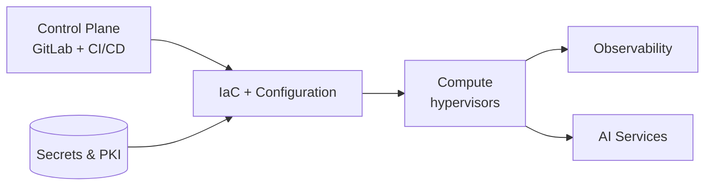

#  DL LABS – Infrastructure , Automation & AI Platform

## 🎯 Purpose

**DL LABS is a self-hosted platform** for experimentation, learning and practical demonstrations accross modern IT infrastructure, automation, platform engineering and AI integration and Orchestration. It is designed for:

- 🔬 **Experimentation** — design and validate production-ready patterns across open-source and enterprise technologies

- 🛠 **Reference blueprints** — reusable IaC modules, playbooks, pipeline templates to enable scalable and automated deployments

- 🏗 **Real-world Enterprise scenarios** — simulate and validate production-like architectures

- 🤖 **AI integration & Ops** — explore self-hosted LLMs, agents, RAG patterns and integrate intelligent automation into IT workflows

---

## 🧱 Core Stack

| Domain | Tools |
|---|---|
| **Compute & Virtualization** | Proxmox  · VMware vSphere  |
| **Containers & Orchestration** | Docker · Kubernetes |
| **Infrastructure as Code & Configuration** | Terraform · Ansible |
| **CI/CD & Automation** | GitLab (self-hosted) · GitLab Runner · AWX · n8n |
| **Identity, Secrets & System Lifecycle** | Active Directory · HashiCorp Vault · Canonical Landscape · Foreman |
| **Network & Edge** | OPNsense · Pi-hole · Nginx Proxy Manager · NetBox |
| **Observability & Security** | Wazuh · Zabbix · Grafana |
| **Self-Hosted AI Stack** | Ollama · LangGraph · Qdrant · Open WebUI |

> *Multi-hypervisor IaC: Terraform modules and Ansible playbooks designed to work seamlessly across Proxmox and vSphere environments.*

**In Progress**

Currently exploring and integrating into the lab:
- **VMware Cloud Foundation (VCF)** — full SDDC stack evaluation
- **Dify** — no-code platform to build AI assistants and workflows

**Cloud-portable** — built on Terraform and Ansible, the same patterns could be extended
beyond the lab's hypervisors to public cloud (AWS, Azure) and enterprise VMware vSphere.

---

## 🧭 Core Focus Area

| | |
|---|---|
| **Engineering** | Infrastructure Engineering · Platform Engineering ·|
| **Automation & AI** | Infrastructure Automation · AI Integration & Orchestration |
| **Security & Identity** | Security Engineering · Identity & Access Management · Observability |
| **Strategy** | Digital Transformation · IT Governance |

---

## 🏗️ Architecture

DL Labs is designed around a stable set of **responsibilities**, not specific products.

- **Control plane** — single source of truth and pipelines; drives everything downstream.
- **IaC layer** declares infrastructure; 
- **Secrets & PKI** back the entire chain , nothing is stored in clear text.
- **Compute** runs on one or more hypervisors, kept deliberately interchangeable.
- **Observability** and **AI services** are cross-cutting and consume the same fabric.

GitLab acts as the central control plane, orchestrating provisioning, configuration management, and CI/CD pipelines . Ansible handles Configuration Management, while Terraform manages declarative infrastructure on Proxmox.

---

## ⚙️ Use Cases

- **Automated VM lifecycle** — Terraform provisions, Ansible configures, AWX orchestrates
- **Patch management at scale** — Canonical Landscape with environment-based access groups, LivePatch, Foreman + Katello
- **Self-service infrastructure** — GitLab pipelines triggering parameterized AWX templates
- **AI-assisted operations** — Local LLMs (Ollama) with RAG (Qdrant) for ops documentation queries
- **Security detection** — Wazuh SIEM with custom rules and Ansible-deployed agents
- **Centralized monitoring** — Zabbix for infrastructure, Grafana for visualization

---

## ✅ Demonstrated Capabilities

- **Infrastructure & IaC** — declarative provisioning, automated VM lifecycle, configuration management.
- **Pipelines** — GitLab CI/CD with Vault-injected secrets.
- **Security** — two-tier internal PKI, centralized secret management, Wazuh detection engineering.
- **Observability** — Zabbix + Grafana monitoring across the estate.
- **Applied AI** — local LLM serving and an MCP tool bridge that lets agents query and act on the lab.

<!--
  ## 🗺️ Roadmap  — to be introduced later.
  Forward-looking items live here once you're ready. Per-project status lives in each
  project's own repository, not on this showcase page.
-->

---

## 🔄 Repository Source

> **This repository is automatically mirrored from a self-hosted GitLab instance.**  
> Active development happens upstream on GitLab. This GitHub repository serves as a 
> public showcase and portfolio reference.
>
> **Pull requests and issues are not accepted on GitHub.** For inquiries, collaboration 
> opportunities, or feedback, please reach out via the contact information below. 
 contact@dossehlassey.me
 
---

## 👤 Author

**Dosseh Lassey**
Founder, DL-LABS - Where Infrastructure Meets Intelligence 
Infrastructure · Engineering · Automation · AI

---

 
